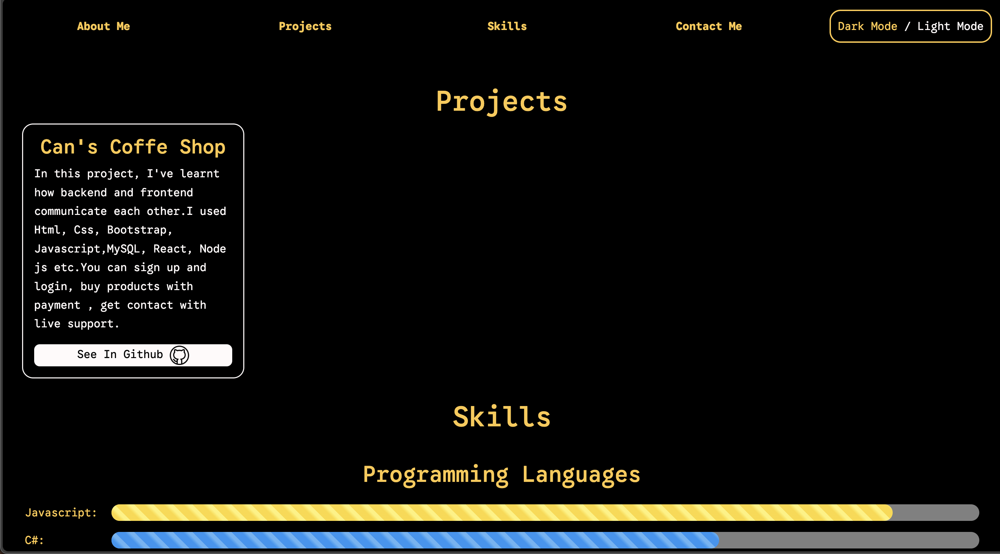
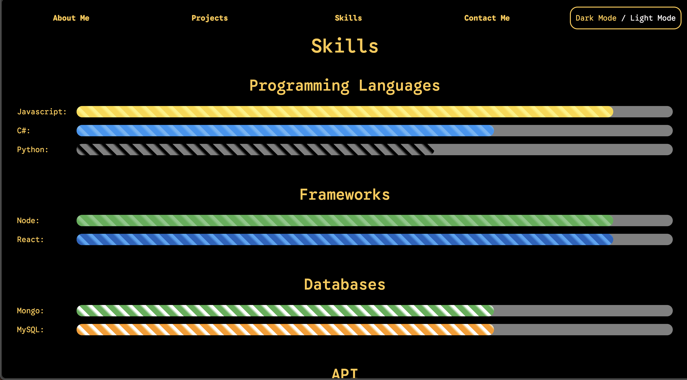
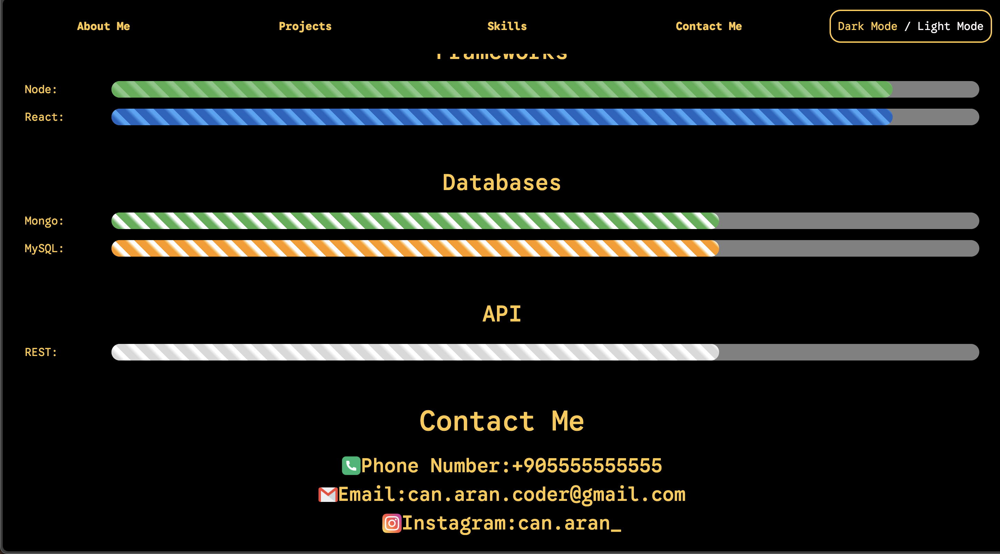
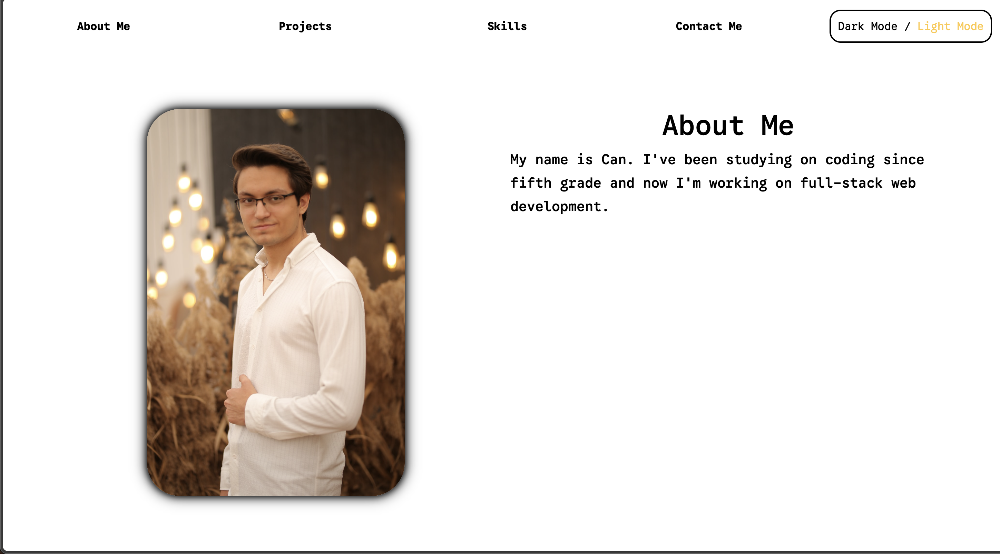
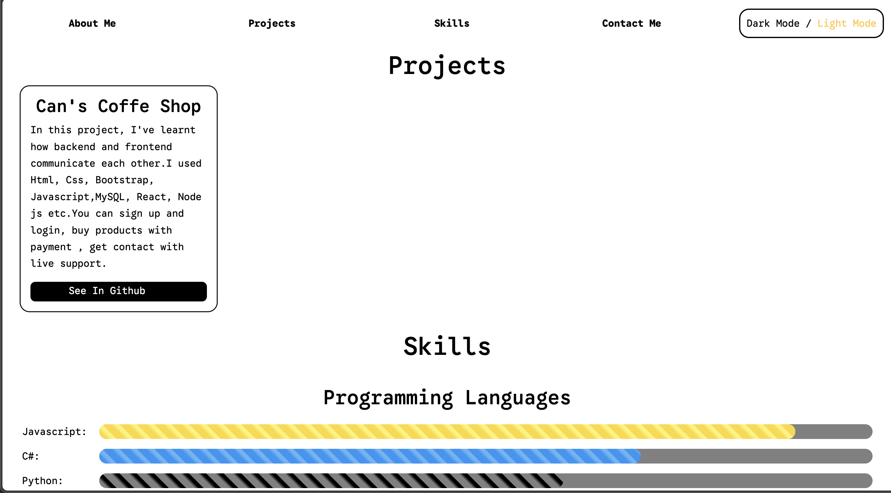
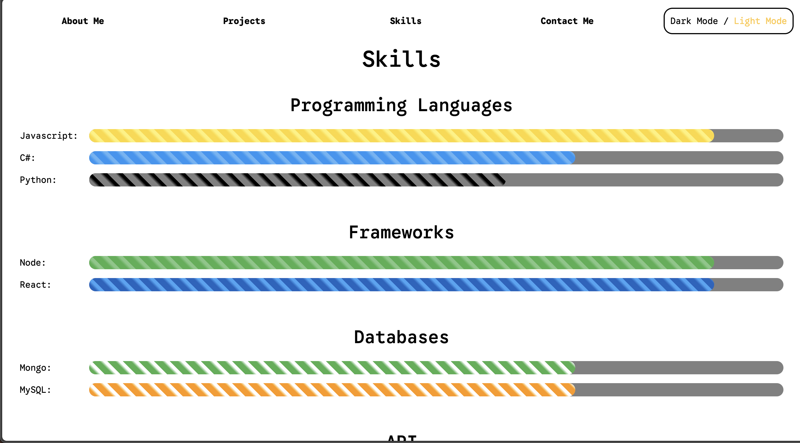
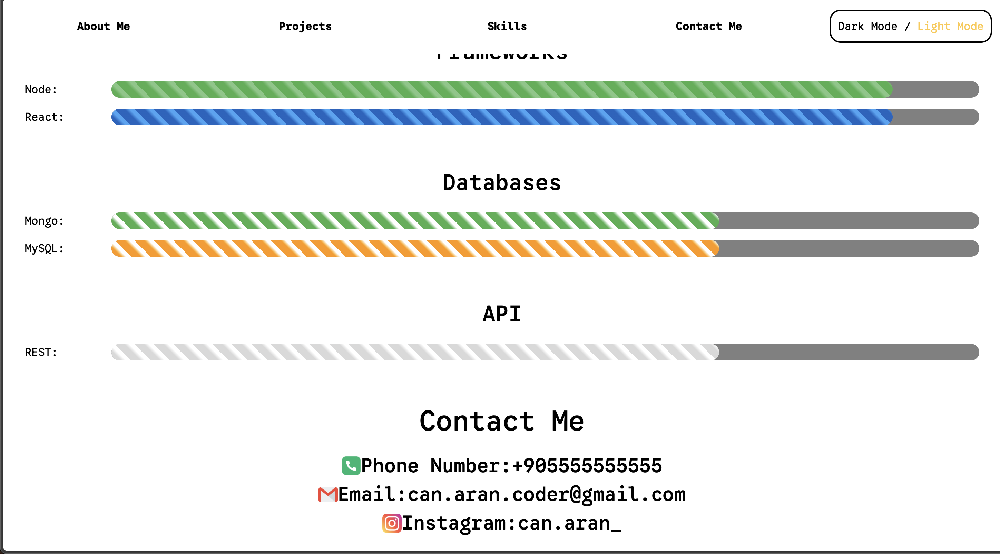

# Portfolio Example

In this project i have designed simple portfolio example.
I used shadows , react scroll and router.
I made **zebra progress** bar without any ui package and **Dark Theme and Light Theme**

# Get And Start The Procjet

## Get The Project

```bash
  git clone git@github.com:CanAran-Coder/Portfolio-Example.git
```

## Requirements And Run

```bash
  npm install react-router-dom
  npm install react-scroll
  npm start
```


## Technologies

- HTML
- CSS
- Bootstrap
- Javascript
- React

# Screenshots








